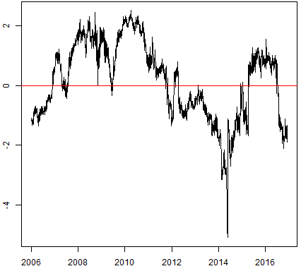
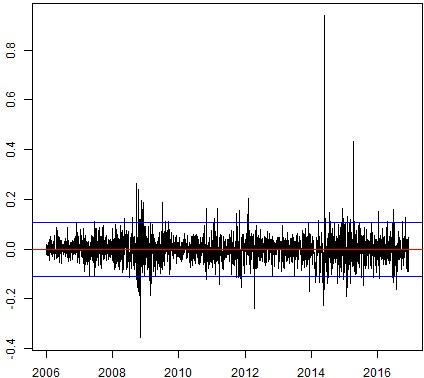

## Introduction

The **partialCI** package fits a partial cointegration model to describe a time series. Partial cointegration (PCI) is a weakening of cointegration, allowing for the residual series to contain a mean-reverting and a random walk component. Analytically, this residual series is described by a partially autoregressive process (PAR -- see @Summers.1986, @Poterba.1988, and @Clegg.2015a), consisting of a stationary AR-process and a random walk. Whereas classic cointegration in the sense of @Engle.1987 requires all shocks to be transient, PCI is more flexible and allows for permanent shocks as well -- a realistic assumption across many (macro)economic applications. Even though neither the residual series, nor its mean-reverting and permanent component are directly observable, estimation is still possible in state space -- see @Brockwell.2010 and @Durbin.2012. 

## The partial cointegration framework

### Model definition

Based on @Engle.1987,  @Clegg.2016 define the concept of partial cointegration as follows: \dfn{Definition}: "The components of the vector $X_t$ are said to be partially cointegrated of order $d$, $b$, denoted $X_t \sim PCI\left(d,b\right)$, if (i) all components of $X_t$ are $I\left(d\right)$; (ii) there exists a vector  $\alpha$ so that $Z_t = \alpha \prime X_t$ and $Z_t$ can be decomposed as a sum $Z_t = R_t + M_t$, where $R_t \sim I\left(d\right)$ and $M_t \sim I\left(d - b\right)$."

Let $Y_t$ denote the target time series and $X_{j,t}$ the $j^{th}$ factor time series at time $t$, where $j = \lbrace 1, 2, \dots, k \rbrace$. The target time series and the $k$ factor time series are partially cointegrated, if a parameter vector $\iota = \left\lbrace\beta_1, \beta_2, \dots, \beta_k, \rho, \sigma_M, \sigma_R, M_0, M_R\right\rbrace$ exists such that the subsequent model equations are satisfied:

$$
\begin{aligned}
      Y_{t} &= \beta_1 X_{1,t} + \beta_2 X_{2,t} + ... + \beta_k X_{k,t}  + W_t \\
      W_t &= M_t + R_t \\
      M_t &= \rho M_{t-1} + \varepsilon_{M,t}\\
      R_t &= R_{t-1} + \varepsilon_{R,t}\\
       \varepsilon_{M,t} &\sim \mathcal{N}\left(0, \sigma^2_M\right)\\
        \varepsilon_{R,t} &\sim \mathcal{N}\left(0, \sigma^2_R\right)\\
        \beta_j \in \mathbb{R}; \rho &\in \left(-1, 1\right);\sigma^2_M, \sigma^2_R \in \mathbb{R}_0^+.  \\
\end{aligned}
$$
Thereby, $W_t$ denotes the partially autoregressive process, $R_t$ the permanent component, $M_t$ the transient component and $\beta = \lbrace \beta_1, \beta_2, \dots, \beta_k \rbrace$ is the partially cointegrating vector. The permanent component is modeled as a random walk and the transient component as an AR(1)-process with $AR(1)$-coefficient $\rho$. The corresponding error terms $\varepsilon_{M,t}$ and $\varepsilon_{R,t}$ are assumed to follow mutually independent, normally distributed white noise processes with mean zero and variances $\sigma^2_M$ and $\sigma^2_R$. A key advantage of modeling the cointegrating process as a partially autoregressive process is that we are able to calculate the proportion of variance attributable to mean-reversion (PVMR), defined as (@Clegg.2016),
$$
R^2_{MR} = \frac{VAR\left[\left(1-B\right)M_t\right]}{VAR\left[\left(1-B\right)W_t\right]} = \frac{2\sigma^2_M}{2\sigma^2_M + \left(1+\rho\right)\sigma^2_R} , \hspace{0.2cm} R^2_{MR} \in \left[0,1\right],  
$$
where $B$ denotes the backshift operator. The statistic $R^2_{MR}$ is useful to assess how close the cointegration process is to either a pure random walk $\left(R^2_{MR} = 0\right)$  or a pure AR(1)-process $\left(R^2_{MR} = 1\right)$. 

### State space represenation

The applied state space transformation is in line with @Clegg.2016. Given that the PAR process $W_t$ is not observable, we convert the PCI model into the following state space model, consisting of an observation and a state equation:  
$$
\begin{align}
X_t &= H Z_t \\ 
Z_t &= FZ_{t-1} + W_t.
\end{align}
$$
Thereby, $Z_t$ denotes the state which is assumed to be influenced linearly by the state in the last period and a noise term $W_t$. The matrix $F$ is assumed to be time invariant. The observable part is denoted by $X_t$. By assumption, there is a linear dependence between $X_t$ and $Z_t$, captured in the time invariant matrix $H$.

### Estimation of a partial cointegration model
Parameters are estimated via the maximum likelihood (ML) method. Using a quasi-Newton algorithm, the ML method searches for the parameters $\rho$, $\sigma^2_M$, $\sigma^2_R$ and the parameter vector $\beta$ which maximizes the likelihood function of the associated Kalman filter.


### A likelihood ratio test routine for partial cointegration}
The likelihood ratio test (LRT) implemented in the **partialCI** package adopts the LRT routine for PAR models proposed by @Clegg.2015a. In a PCI scenario the null hypothesis consists of two conditions -- namely the hypothesis that the residual series is a pure random walk ($\mathcal{H}^R_0$) or a pure AR(1)-process $(\mathcal{H}^M_0)$. The two conditions are separately tested. Only if both, $\mathcal{H}^R_0$ and $\mathcal{H}^M_0$ are individually rejected, the null hypothesis of no partial cointegration is rejected.

## Using the PCI package

The main functions of the **partialCI** package are fit.pci(), test.pci(), statehistory.pci(), and hedge.pci().

### fit.pci()

The function **fit.pci()** fits a partial cointegration model to a given collection of time series. 

```
fit.pci(Y, X, pci_opt_method = c("jp", "twostep"), par_model = c("par", "ar1", "rw"), lambda = 0, robust = FALSE, nu = 5, include_alpha=FALSE)} 
```
* `Y`: Denotes the target time series and `X` is a matrix containing the `k` factors used to model `Y`.
* `pci_opt_method`: Specifies, whether the joint-penalty method (`"jp"`) or the (`"twostep"`) method is applied to obtain the model with the best fit. If `pci_opt_method` is specified as `"twostep"`, a two-step procedure similar to the method introduced by @Engle.1987 is performed. Which model is fitted to the residual series, depends on the specification for the argument `par_model`. In case of `"par"`, a partial autoregressive model is used, in case of `"ar1"`, an AR(1)-process and in case of `"rw"` a random walk (default: `par_model = "par"`). On the other hand, if the `pci_opt_method` is specified as `"jp"`, the joint-penalty method is applied, to estimate $\beta$, $\rho$, $\sigma_M^2$ and $\sigma_R^2$ jointly via ML. The likelihood score of the associated Kalman filter is extended by a penalty value $\lambda\sigma_R^2$ (default: `lambda = 0`), where $\lambda \in \mathbb{R}_0^+$ (default: `pci_opt_method = "jp"`).
* `robust`: Determines whether the residuals are assumed to be normally (`FALSE`) or $t$-distributed (`TRUE`) (default: `robust = TRUE`). If `robust` is set to `TRUE` the degrees of freedom can be specified, using the argument `nu` (default: `nu = 5`). 
* `include_alpha`: If `TRUE`, an intercept $\alpha$ is added to the PCI relationship (default: `include_alpha = FALSE`).


###  test.pci()

The **test.pci()** function tests the goodness of fit of a PCI model. 

```
test.pci(Y, X, alpha = 0.05, null_hyp = c("rw", "ar1"),  robust = FALSE, pci_opt_method = c("jp", "twostep"))}
```
* `alpha`: Determines at which significance level the null hypothesis is rejected (default: `alpha = 0.05`).
* `null_hyp`: Specifies whether the null hypothesis is a random walk (`"rw"`), an AR(1)-process (`"ar1"`) or a union of both hypotheses (`c("rw", "ar1")`) (default: `null_hyp = c("rw", "ar1")`).

### statehistory.pci()

To estimate the sequence of hidden states the **statehistory.pci()** function can be applied. 

```
statehistory.pci(A, data = A\$data, basis = A\$basis)}
```
* `A`: Denotes a fit.pci() object.
* `data`: Is a matrix consisting of the target time series and the `k` factor time series (default: `data = A\$data`).
* `code{basis`: Captures the coefficients of the factor time series (default: `basis = A\$basis`).

###hedge.pci()

The function **hedge.pci()** finds those `k` factors from a predefined set of factors which yield the best fit to the target time series. 

```
hedge.pci(Y, X, maxfact = 10, lambda = 0, use.multicore = TRUE, minimum.stepsize = 0, verbose = TRUE, exclude.cols = c(), search_type = c("lasso", "full", "limited"), pci_opt_method=c("jp", "twostep"))}
```

* `maxfact`: Denotes the maximum number of considered factors (default: * `maxfact = 10`).
* `use.multicore`: If `TRUE`, parallel processing is activated (default: * `use.multicore = TRUE`).
* `verbose`: Controls whether detailed information are printed (default: `verbose = TRUE`).
* `exclude.cols`: Defines a set of factors which should be excluded from the search routine (default: `exclude.cols = c()`).
* `search_type`: Determines the search algorithm applied to find the model that fits best to the target time series. The likelihood ratio score (LRT score) is used to compare the model fits, whereby lower scores are associated with better fits. If the option `"lasso"` is specified the lasso algorithm as implemented in the R package **glmnet** [@Friedman.2010] is deployed to search for the portfolio of factors that yields the best linear fit to the target time series. If the option `"full"` is specified, then at each step, all possible additions to the portfolio are considered and the one which yields the highest likelihood score improvement is chosen. If the option `"limited"` is specified, then at each step, the correlation of the residuals of the current portfolio is computed with respect to each of the candidate series in the input set $X$, and the top $B$ series are chosen for further consideration. Among these top $B$ candidates, the one which improves the likelihood score by the greatest amount is chosen. The parameter $B$ can be controled via `maxfact` (default: `search_type = "lasso"`).

## Example

As an introductory example, we explore the relationship between Royal Dutch Shell plc A (RDS-A) and Royal Dutch Shell plc B (RDS-B), using daily (closing) price data from 1 January 2006 to 1 December 2016.RDS-A (@RDSA.2016) and RDS-B (@RDSB.2016) data are downloaded from Yahoo Finance. To download the price data we use the getYahooData() function, implemented in the R package **TTR** (@Ulrich.2016).

```
	library(partialCI)
	library(TTR)
	
	RDSA<-getYahooData("RDS-A", 20060101, 20161201)$Close
	RDSB<-getYahooData("RDS-B", 20060101, 20161201)$Close
```

A classic cointegration analysis yields that the two time series are not cointegrated.

```
	library(egcm)

	egcm_finance <- egcm(RDSA,RDSB,include.const = FALSE)
```

In particular, we apply the two-step approach of @Engle.1987 implemented in the R package **egcm** (@Clegg.2015c).

The following residual plot (code: `plot(egcm\_finance\$residuals,type = "l")`) suggests that the residual series is not purely mean-reverting, but rather shows a stochastical trend as well as a mean-reverting behavior. 




Hence, it is not suprising that RDS-A and RDS-B are not cointegrated. Using the PCI framework, we are able to fit a PCI model to RDS-A and RDS-B.

```
PCI_RDSA_RDSB<-fit.pci(RDSA, RDSB, pci_opt_method = c("jp"), par_model =c("par"), lambda = 0, robust = FALSE, nu = 5, include_alpha = FALSE))
```

The R output is given as

```
	Fitted values for PCI model
  	Y[t] = X[t] %*% beta + M[t] + R[t]
  	M[t] = rho * M[t-1] + eps_M [t], eps_M[t] ~ N(0, sigma_M^2)
  	R[t] = R[t-1] + eps_R [t], eps_R[t] ~ N(0, sigma_R^2)

                   	 Estimate Std. Err
	beta_Close   	0.9274   0.0038
	rho         	 0.3959   0.0965
	sigma_M      	0.1081   0.0083
	sigma_R      	0.1195   0.0076

	-LL = -1117.29, R^2[MR] = 0.540,
```
where `beta_Close` denotes the partially cointegrating coefficient. The PVMR of 0.54 suggests that the spread time series also exhibits a clear mean-reverting behavior.

In the subsequent step, we utilize the test.pci() function to check whether RDS-A and RDS-B are partially cointegrated.

The R code

```
test.pci(RDSA, RDSB, alpha = 0.05, null_hyp = c("rw", "ar1"), robust = FALSE, pci_opt_method = c("jp"))
```

leads to the following output:

```
	Likelihood ratio test of [Random Walk or CI(1)] vs Almost PCI(1)
		(joint penalty method)

	data:  StockA

	Hypothesis              Statistic    p-value
	Random Walk                -55.09      0.010
	AR(1)                      -52.88      0.010
	Combined                               0.010.
```
A time series is classified as partially cointegrated, if and only if the random walk as well as the AR(1)-hypotheses are rejected. The $p$-value of 0.010 for the combined null hypothesis indicates that RDS-A and RDS-B are partially cointegrated in the considered period of time.

Next, we demonstrate the use of the statehistory.pci() function which allows to estimate and extract the hidden states.
The R code,

```
statehistory.pci(PCI_RDSA_RDSB)},

```

results in the R output:
```
                 Y     Yhat         Z           M         R        eps_M        eps_R
	2006-01-03 35.87002 35.26781 0.6022031  0.00000000 0.6022031  0.00000000  0.00000000
	2006-01-04 36.23993 35.57175 0.6681755  0.02030490 0.6478706  0.02030490  0.04566752
	2006-01-05 35.80276 35.24161 0.5611509 -0.02112621 0.5822771 -0.02916450 -0.06559352
	2006-01-06 36.48653 35.83377 0.6527591  0.01590352 0.6368556  0.02426695  0.05457850
	...
	2016-11-25 50.18000 49.52231 0.6576906 -0.08762384 0.7453144 -0.07643882 -0.17191764
	2016-11-28 49.20000 48.22397 0.9760311  0.04699758 0.9290335  0.08168603  0.18371909
	2016-11-29 49.06000 48.02922 1.0307808  0.04419468 0.9865862  0.02558931  0.05755262
	2016-11-30 51.10000 50.23639 0.8636066 -0.02573955 0.8893462 -0.04323530 -0.09724000
	2016-12-01 51.78000 51.15450 0.6254956 -0.08826115 0.7137567 -0.07807140 -0.17558945.
```
The latter table covers the estimates of the hidden states $M$ and $R$ as well as the corresponding error terms `eps_M` and `eps_R`. `Z` is equal to the sum of $M$ and $R$. The estimate of the target time series is denoted by `Yhat`.

The subsequent figure illustrates a plot of the extracted mean-reverting component of the spread associated with the RDS-A and RDS-B price time series (``plot(statehistory.pci(PCI_RDSA_RDSB)[,4],type = "l",ylab = "", xlab = "")`). 




The horizontal blue lines are equal to two times the historical standard deviation in absolute terms of the mean-reverting component. A pairs trading strategy could exploit the mean-reverting behavior of $M_t$. Note that this example is in-sample; for a true out-of-sample application see @Clegg.2016.

We continue with using hedge.pci() to find the set of sector ETFs forming the best hedging portfolio for the SPY index (S&P500 index).

Thereby, the R code,
````
	sectorETFS <- c("XLB", "XLE", "XLF", "XLI", "XLK", "XLP", "XLU", "XLV", "XLY")
	prices <- multigetYahooPrices(c("SPY", sectorETFS), start=20060101)

	hedge.pci(prices[,"SPY"], prices),
````

results in the subsequent output: 
````
  -LL   LR[rw]    p[rw]    p[mr]      rho  R^2[MR]      Factor |   Factor coefficients
 2320.00 -23.3743   0.0100   0.0100   0.5759   0.4526      XLI |   3.1106 
 1765.50 -46.5925   0.0100   0.0100   0.3170   0.4713      XLY |   1.8951  1.1989 
 1494.95 -53.7256   0.0100   0.0100   0.3244   0.5038      XLV |   1.6999  0.9106  0.6619 
  972.58 -65.9058   0.0100   0.0100   0.4060   0.5904      XLK |   1.3089  0.4933  0.5320. 1.5182 
````
The table summarizes information about the best hedging portfolio, where each row corresponds to an increasing number of factors.  Row 1: The best single-factor hedging portfolio comprises XLI (industrials) as only factor. Row 2: The best two-factor hedging portfolio consists of XLI and XLY (consumer discretionary). As such, XLY leads to the best improvement of the LRT score among all remaining factors. Row 3 includes XLV (health care) for the three-factor portfolio and row 4 XLK (technology) for the best four-factor portfolio. The last row corresponds to the overall best fit out of the nine potential sector ETFs, based on the LRT score. Note that for all rows, the union of random walk and AR(1)-null hypothesis is rejected at the 5 percent significant level, so we find a PCI model at each step. 

## References